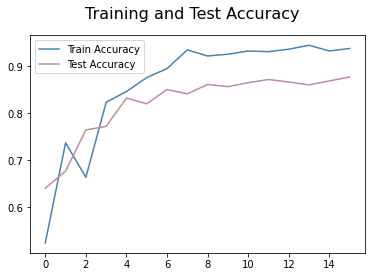
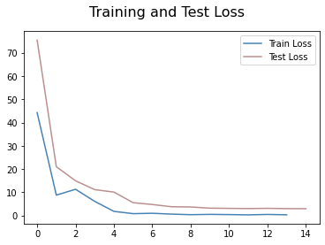
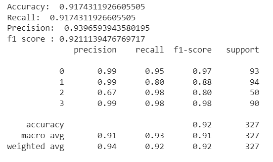

# brain-tumor-classification

## Inspiration:
A Brain tumor is considered as one of the aggressive diseases, among children and adults. Brain tumors account for 85 to 90 percent of all primary Central Nervous System(CNS) tumors. Every year, around 11,700 people are diagnosed with a brain tumor. The 5-year survival rate for people with a cancerous brain or CNS tumor is approximately 34 percent for men and36 percent for women. Brain Tumors are classified as: Benign Tumor, Malignant Tumor, Pituitary Tumor, etc. Proper treatment, planning, and accurate diagnostics should be implemented to improve the life expectancy of the patients. The best technique to detect brain tumors is Magnetic Resonance Imaging (MRI). A huge amount of image data is generated through the scans. These images are examined by the radiologist. A manual examination can be error-prone due to the level of complexities involved in brain tumors and their properties.
Application of automated classification techniques using Machine Learning(ML) and Artificial Intelligence(AI)has consistently shown higher accuracy than manual classification. Hence, proposing a system performing detection and classification by using Deep Learning Algorithms using ConvolutionNeural Network (CNN), Artificial Neural Network (ANN), and TransferLearning (TL) would be helpful to doctors all around the world.

## Context:
Brain Tumors are complex. There are a lot of abnormalities in the sizes and location of the brain tumor(s). This makes it really difficult for complete understanding of the nature of the tumor. Also, a professional Neurosurgeon is required for MRI analysis. Often times in developing countries the lack of skillful doctors and lack of knowledge about tumors makes it really challenging and time-consuming to generate reports from MRI’. So an automated system on Cloud can solve this problem.

## Definition:
To Detect and Classify Brain Tumor using TL (with Model-ResNet101V2) as an asset of Deep Learning and to examine the tumor position(segmentation).

## Data:
The dataset can be downloaded from here:

https://www.kaggle.com/datasets/sartajbhuvaji/brain-tumor-classification-mri?select=Training

The dataset contain 4 classes- no tumor and 3 different position of brain tumor.

## Environment and packages:
1.Numpy

2.Pandas

3.Scikit-image

4.Matplotlib

5.Scikit-learn

6.Keras

7.Scipy

## Required installations:
pip install scikit-learn

pip install --upgrade tensorflow-hub

pip3 install scipy 

## Results:

The model is able to reach a validation accuracy of 92%

 

## Project files:
1. The folder "files"- the results for the readme.
2. "split.ipynd"- the code to split the download data (to train, test and validation).
3. "Cbraintumor_net.ipynb"- the tl on the data with predict and results.

